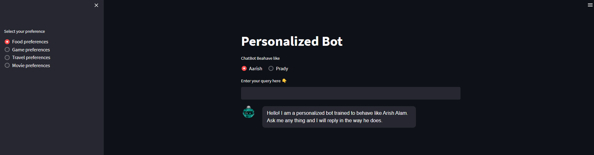

# Personalized Chat Bot

This project is an innovative approach to create a personalized bot using your WhatsApp data. We utilize Pinecone, Langchain, and OpenAI services to achieve a more individualized user interaction experience.

## <u>Description</u>
This project aims to create a personalized bot that can simulate a user's messaging style using their WhatsApp data. The bot can be used for various purposes such as automating responses, mimicking a user's texting style, or creating a digital avatar.

We use the following services:

- **WhatsApp as a data source** : We use your exported WhatsApp chat data as the base for creating the bot's personality. 
- **Pinecone**: A vector database used for similarity search, personalization, and machine learning. In this project, Pinecone is used to create and manage the vector representations of the WhatsApp messages. 
- **Langchain**: LangChain is a framework for developing applications powered by language models 
- **OpenAI**: We use OpenAI's GPT model to generate responses that simulate a user's personal messaging style.

There is clear demonstration for every step that was carried out in the notebooks provided. 

## <u>Notebooks</u>

[Proccesing Whatsapp Data](https://github.com/RheagalFire/personalized_chat_bot/blob/main/notebooks/1%20.%20Convert%20And%20Clean%20Whatsapp%20Data.ipynb) : Includes reading the .txt file from the chat export and cleaning it and structuring the data for feeding it to pinecone. 
[Embedding Creation](https://github.com/RheagalFire/personalized_chat_bot/blob/main/notebooks/2.%20Embeddings%20creation.ipynb) : To perform vector search , create Embeddings using text-embedding-ada-002 model. 
[Ingesting Data to Pinecone](https://github.com/RheagalFire/personalized_chat_bot/blob/main/notebooks/3.%20Pinecone%20Push%20Data.ipynb) : In this notebook , ingest vectors along with metadata to the pinecone index. (includes creating an pinecone index and pushing data in batches) 
[Query the Pinecone Datbase](https://github.com/RheagalFire/personalized_chat_bot/blob/main/notebooks/4.%20Pinecone%20Query%20Data.ipynb) : Discusses how to query the pinecone database. 
[OpenAi Bot with Conversational Memory](https://github.com/RheagalFire/personalized_chat_bot/blob/main/notebooks/5.%20Langchain%2B%20Pinecone%20%2B%20Openai.ipynb) : Demonstrates how to create a Conversational Bot that can rembeber previous chat details.

## <u> Local Setup</u>
`git clone https://github.com/RheagalFire/personalized_chat_bot.git `

Put your OPENAI_API_KEY and PINECONE_KEY in the .env file. (create a .env file)

`docker build -t container_name .`

`docker run -p 8501:8501 container_name:tag`

Your app would run in localhost:8501

